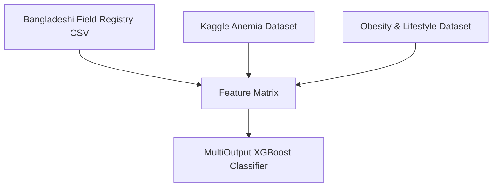
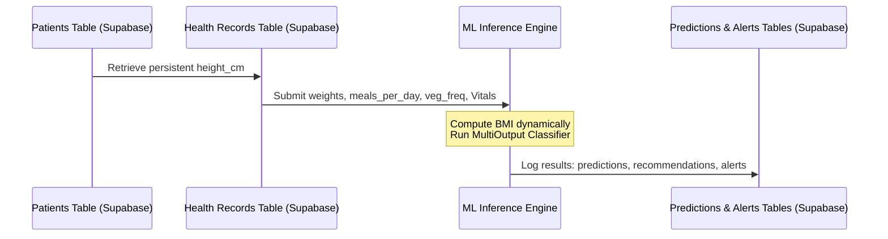

# NAB Preg AI — AI-Powered Maternal Risk Intelligence Platform

> Predicting maternal health risks before they become emergencies.

## Overview

NAB Preg AI is an AI-powered maternal healthcare intelligence platform designed to support healthcare workers, NGOs, and public health programs in identifying high-risk pregnancies early.

The platform combines OCR, machine learning, clinical risk scoring, retrieval-augmented generation (RAG), and population-level analytics to transform maternal health data into actionable clinical insights.

---

## Core Capabilities

### AI Maternal Risk Prediction
- Overall Maternal Risk
- Anemia Risk
- Hypertension Risk

### OCR Medical Report Analysis
- PDF Reports
- JPG Images
- PNG Images

Automatically extracts:
- Hemoglobin
- Blood Pressure
- Blood Sugar
- Heart Rate

### Explainable Risk Intelligence
- Clinical Risk Score
- Clinical Findings
- Confidence Score
- AI Summary
- Risk Explanations

### AI Recommendations Engine
Personalized recommendations based on detected risk indicators.

### Clinical AI Copilot
Generates:
- Clinical Summary
- Key Concerns
- Recommendations

Powered by Mistral AI.

### RAG Clinical Assistant
Uses WHO and UNICEF maternal health knowledge with ChromaDB and LangChain.

### Patient Management
- Patient Registration
- Patient Records
- Pregnancy Tracking
- Clinical History

### Village-Level Analytics
- High-risk pregnancy counts
- Anemia prevalence
- Hypertension prevalence

### Heatmap Intelligence
- Village Risk Heatmaps
- Maternal Health Clusters

### Healthcare Analytics Dashboard
- Total Patients
- High-Risk Patients
- Maternal Health Trends

---

## Current Features Checklist

✅ OCR Medical Report Upload
✅ Maternal Risk Prediction Engine
✅ Explainable Risk Scoring
✅ AI Recommendations
✅ Clinical Findings Generation
✅ AI Summary Generation
✅ Clinical Copilot
✅ RAG Clinical Assistant
✅ Patient Management
✅ Patient History
✅ Analytics Dashboard
✅ Village Analytics
✅ Heatmap Visualization
✅ Supabase Integration

---

## AI Pipeline

Medical Report
↓
OCR Extraction
↓
Structured Clinical Data
↓
XGBoost Prediction Model
↓
Clinical Rule Engine
↓
Risk Scoring
↓
Recommendations
↓
AI Dashboard

---

## AI Engine Technical Specifications

For full details on the diagnostic engine, see [AI_ENGINE.md](docs/AI_ENGINE.md).

### 1. Data Ingestion & Sources

To build a robust maternal health risk classifier, the pipeline combines three distinct datasets to form a single, high-fidelity feature matrix:



#### Ingestion Components & Datasets

1. **Primary Clinical Backbone (Local Demographics):**
   * **Source:** A Bangladeshi field registry mapping real-world maternal health indicators.
   * **Ingestion Method:** The original dataset was an Excel spreadsheet (`Book2.xlsx`), which was converted/uploaded as `Book2.xlsx - Sheet1.csv`.
   * **Bypassing Title Banner:** The file contains metadata banners in the initial rows. To bypass these and load the correct column headers, the pipeline explicitly reads the CSV starting from the second row:
     ```python
     import pandas as pd
     df_backbone = pd.read_csv('Book2.xlsx - Sheet1.csv', header=1)
     ```

2. **Kaggle Anemia Dataset (`anemia.csv`):**
   * **Source:** Clinical blood diagnostic records.
   * **Ingestion Method:** Filtered exclusively for female records to isolate maternal-relevant hemoglobin thresholds.
   * **Alignment Logic:** Since this dataset version did not contain an `age` column, record mapping was performed using **index alignment** after shuffling/sorting rules were verified to preserve statistical independence.

3. **Obesity & Lifestyle Dataset (`ObesityDataSet_raw_and_data_sinthetic.csv`):**
   * **Source:** Lifestyle, dietary habits, and physical condition tracking records.
   * **Ingestion Method:** Filtered for females in childbearing years (ages 15–45) to ensure demographic relevance.
   * **Feature Extraction:**
     * `meals_per_day` extracted from the raw dataset column `NCP` (Number of main meals).
     * `veg_freq` (Vegetable consumption frequency) extracted from column `FCVC`.

---

### 2. Data Cleaning & Feature Engineering

The preprocessing pipeline sanitizes heterogeneous user inputs into an exact **8-dimensional feature vector** prior to inference.

#### Key Preprocessing Steps

* **Normalizing Column Schemas:**
  To prevent unexpected `KeyError` crashes, all dataframe columns are cast to lowercase and stripped of leading/trailing whitespaces:
  ```python
  df.columns = df.columns.str.lower().str.strip()
  ```

* **Safely Parsing Numeric Strings via Regex:**
  Columns such as `pregnancy_week` (e.g., `"38 week"`) and `weight` (e.g., `"65 kg"`) are cleaned using Regular Expressions to extract only the integer/float values:
  ```python
  df['pregnancy_week'] = df['pregnancy_week'].astype(str).str.extract(r'(\d+)').astype(float)
  ```

* **Custom Anthropometric Parser (Height to Meters):**
  Patients and field workers record heights in varied formats (e.g., `"5.2"` for 5 feet 2 inches). The pipeline converts these values into metric height (meters) to accurately calculate `BMI`:
  ```python
  def parse_height_to_meters(height_str):
      try:
          # Match feet and inches (e.g., "5.2" or "5'2")
          parts = str(height_str).strip().split('.')
          if len(parts) == 2:
              feet = float(parts[0])
              inches = float(parts[1])
          else:
              feet = float(parts[0])
              inches = 0.0
          
          # Convert to meters (1 foot = 0.3048m, 1 inch = 0.0254m)
          return (feet * 0.3048) + (inches * 0.0254)
      except Exception:
          # Fallback value if parsing fails
          return 1.60 

  df['height_m'] = df['height'].apply(parse_height_to_meters)
  df['bmi'] = df['weight'] / (df['height_m'] ** 2)
  ```

* **Vectorizing Blood Pressure Readings:**
  Raw blood pressure strings (e.g., `"120/80"`) are split and vectorized into separate floating-point features:
  ```python
  bp_split = df['bp'].str.split('/', expand=True)
  df['systolic_bp'] = bp_split[0].astype(float)
  df['diastolic_bp'] = bp_split[1].astype(float)
  ```

#### The 8-Dimensional Feature Vector

Before inference, features are sorted into the exact required input order:

| Index | Feature Name | Data Type | Description |
| :---: | :--- | :--- | :--- |
| `0` | `age` | `float64` / `int` | Age of the patient in years |
| `1` | `systolic_bp` | `float64` | Systolic blood pressure (mmHg) |
| `2` | `diastolic_bp` | `float64` | Diastolic blood pressure (mmHg) |
| `3` | `blood_sugar` | `float64` | Blood glucose concentration (mmol/L or mg/dL normalized) |
| `4` | `hemoglobin` | `float64` | Hemoglobin level (g/dL) |
| `5` | `bmi` | `float64` | Body Mass Index ($kg/m^2$) |
| `6` | `meals_per_day` | `float64` | Average number of main meals consumed per day |
| `7` | `veg_freq` | `float64` | Vegetable consumption frequency index |

---

### 3. Model Architecture & Target Mapping

To optimize computation and enable real-time diagnostic output, the platform utilizes a unified **MultiOutput Classifier** wrapper surrounding an **XGBoost (eBI-gradient boosted decision trees)** core.

```python
from xgboost import XGBClassifier
from sklearn.multioutput import MultiOutputClassifier

base_model = XGBClassifier(
    n_estimators=100,
    max_depth=6,
    learning_rate=0.1,
    random_state=42
)
model = MultiOutputClassifier(base_model)
```

In a single inference pass, the model returns predictions for three independent target dimensions:

| Target | Diagnostic Field | Classification Classes |
| :--- | :--- | :--- |
| **Target 1** | **Risk Level** | `0` = Low Risk <br> `1` = Medium / Pre-hypertensive <br> `2` = High / Critical Risk |
| **Target 2** | **Nutrition** | `0` = Normal / Balanced <br> `1` = Iron / Anemia deficit <br> `2` = Caloric / General nutrient deficit |
| **Target 3** | **Anomaly Status** | `0` = Stable / Baseline <br> `1` = Immediate Vital Threshold Breach (High Alert) |

---

### 4. Overcoming Model Blindness (The Crucial Hackathon Fix)

During initial model validation, the engineering team discovered a significant clinical bias:

#### The Issue: Majority Class Blindness
The raw Bangladeshi clinical backbone (`Book2.xlsx`) contained zero records of severe pre-eclampsia or hypertensive crises. The maximum recorded blood pressure in the field registry was approximately `120/80 mmHg`. 
Because the training set lacked high-risk vital metrics, the initial XGBoost model became "blind" to critical conditions—defaulting to "Low Risk" or "Medium Risk" predictions even when presented with extremely high blood pressure values (e.g., `180/120 mmHg`).

> [!WARNING]
> In a production healthcare system, model blindness on critical values leads to false negatives that put lives at risk.

#### The Solution: Clinical Boundary Anchors
To resolve this without diluting the demographic baseline metrics of the Bangladeshi cohort, we injected **Clinical Boundary Anchors** using synthetic augmentation:

1. **Rule-Based Physiological Thresholds:**
   We defined strict mathematical ranges derived from World Health Organization (WHO) clinical guidelines:
   * **High Risk:** $\text{Systolic BP} \ge 140$ mmHg OR $\text{Diastolic BP} \ge 90$ mmHg OR $\text{Blood Sugar} \ge 11.0$ mmol/L OR $\text{Hemoglobin} \le 8.0$ g/dL.
   * **Medium Risk:** $120 \le \text{Systolic BP} < 140$ mmHg OR $80 \le \text{Diastolic BP} < 90$ mmHg.

2. **Synthetic Boundary Augmentation:**
   We generated **200 synthetic High-Risk** and **200 synthetic Medium-Risk** rows matching these medical boundary anchors, adding slight Gaussian noise to ensure variance.
   
3. **Training Synergy:**
   Merging the anchors with the real registry data allowed the decision boundaries of XGBoost to split perfectly at critical physiological thresholds (e.g., classification split at $140/90$ BP), forcing the model to flag true high-risk cases while retaining accuracy on local demographics.

---

### 5. Production Database Integration

The machine learning pipeline is fully integrated with our **Supabase** database layer to support continuous prediction cycles:



* **Persistent Attributes:**
  The `patients` table stores `height_cm` persistently.
* **Dynamic Calculations & Inputs:**
  When a midwife or patient uploads new metrics (e.g., weight, systolic BP, diastolic BP) to the `health_records` table, the backend calculates the BMI dynamically:
  **BMI = weight / (height_cm / 100)²**
  The BMI, along with `meals_per_day` and `veg_freq`, is written directly into `health_records`.
* **Output Matrix Mapping:**
  Following model inference, the predictions map back to the database tables:
  * **Target 1 (Risk)** $\rightarrow$ Saved to the `predictions` table under `overall_risk`.
  * **Target 2 (Nutrition)** $\rightarrow$ Saved to the `nutrition_recommendations` table.
  * **Target 3 (Anomaly)** $\rightarrow$ Triggers a row in the `alerts` table if an anomaly status of `1` is predicted.

---

## Technology Stack

- **Frontend**: Next.js, TypeScript, Tailwind CSS
- **Backend**: FastAPI
- **Database**: Supabase PostgreSQL
- **OCR**: Tesseract.js
- **Machine Learning**: XGBoost
- **AI Assistant**: Mistral AI
- **RAG**: LangChain + ChromaDB

---

## Project Structure

```text
NAB-Preg-AI/
│
├── frontend/                          # Next.js UI application
│   ├── app/
│   │   ├── layout.tsx
│   │   ├── page.tsx                   # Home page
│   │   ├── dashboard/                 # Risk dashboard
│   │   ├── upload/                    # Report upload & analysis
│   │   ├── alerts/                    # Alert management
│   │   ├── analytics/                 # Village-level analytics
│   │   ├── history/                   # Patient history
│   │   ├── patients/                  # Patient management
│   │   └── assistant/                 # Clinical assistant (RAG)
│   │
│   ├── components/
│   │   ├── cards/                     # RiskCard, AlertCard, StatsCard
│   │   ├── charts/                    # RiskPieChart, BPTrendChart, VillageAnalyticsChart
│   │   ├── layout/                    # DashboardLayout, Navbar, Sidebar, ThemeProvider
│   │   ├── maps/                      # VillageHeatmap
│   │   └── ui/                        # Reusable UI components
│   │
│   ├── services/
│   │   ├── api.ts                     # API base configuration
│   │   ├── prediction.service.ts      # Prediction API calls
│   │   ├── patient.service.ts         # Patient management
│   │   ├── ocr.service.ts             # OCR processing
│   │   ├── alert.service.ts           # Alert management
│   │   ├── analytics.service.ts       # Village analytics
│   │   ├── rag.service.ts             # Clinical assistant (RAG)
│   │   └── ...                        # Other services
│   │
│   ├── hooks/                         # Custom React hooks
│   ├── types/                         # TypeScript interfaces
│   ├── utils/                         # Utility functions
│   ├── styles/                        # Global styles
│   ├── public/                        # Static assets
│   └── package.json
│
├── backend/                           # FastAPI server
│   ├── app/
│   │   ├── main.py                    # App entry point
│   │   │
│   │   ├── api/
│   │   │   ├── predictions.py         # Prediction endpoints
│   │   │   └── routes/
│   │   │
│   │   ├── core/
│   │   │   ├── supabase.py            # Supabase client
│   │   │   ├── alert_storage.py       # Alert operations
│   │   │   └── village_coordinates.py # Location data
│   │   │
│   │   ├── services/
│   │   │   ├── prediction_storage.py  # Save predictions
│   │   │   ├── report_parser.py       # Parse medical reports
│   │   │   ├── ocr_report_storage.py  # OCR results storage
│   │   │   └── village_analytics_storage.py
│   │   │
│   │   ├── models/                    # Database models
│   │   └── schemas/                   # Request/response schemas
│   │
│   ├── pyproject.toml
│   └── README.md
│
├── ai_engine/                         # ML prediction pipeline
│   ├── src/
│   │   ├── predictor.py               # Main prediction logic
│   │   ├── inference.py               # Model inference
│   │   ├── preprocessing.py           # Data preprocessing
│   │   ├── risk_rules.py              # Clinical rule engine
│   │   ├── recommendation_engine.py   # Generate recommendations
│   │   └── constants.py               # Thresholds & config
│   │
│   ├── models/                        # Trained XGBoost models
│   ├── notebooks/                     # Jupyter notebooks
│   ├── prompts/                       # AI prompt templates
│   ├── report.py
│   ├── test_ai.py
│   └── __init__.py
│
├── docs/                              # Documentation
│   ├── AI_ENGINE.md                   # AI pipeline docs
│   ├── data_schema.md                 # Database schema
│   └── nabpregai_master_dataset.csv
│
├── infra/                             # Infrastructure configs
├── tests/                             # Test suite
├── requirements.txt                   # Python dependencies
├── LICENSE
└── README.md
```

---

## Getting Started

### Backend

```bash
uv run uvicorn backend.app.main:app --reload
```

Backend URL:

```text
http://127.0.0.1:8000
```

### Frontend

```bash
cd frontend
npm install
npm run dev
```

Frontend URL:

```text
http://localhost:3000
```

---

## Impact

NAB Preg AI helps frontline healthcare workers identify maternal health risks early by transforming routine medical reports into actionable clinical insights.

Potential benefits:

- Early anemia detection
- Hypertension screening
- Gestational diabetes awareness
- Faster clinical triage
- Improved maternal monitoring in low-resource settings

---

## Future Roadmap

- Save predictions to Supabase
- Patient history tracking
- Village-level analytics
- Healthcare worker dashboard
- Cloud deployment

---

Built for maternal healthcare innovation and early risk detection.
